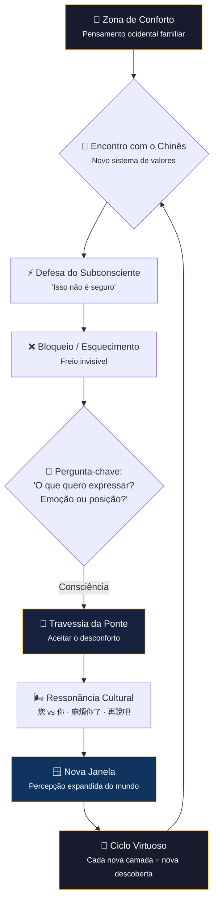

### 1. 爆款標題 (Hook Title)

> **「Você Não Aprende Chinês Com a Cabeça de Ontem」**
> *Para dominar o mandarim, não basta decorar palavras — é preciso deixar seu subconsciente mudar de endereço.*

### 2. 5W2H 核心矩陣 (The Strategy Table)

| 維度 | 關鍵解析 | 視覺映射 |
| :--- | :--- | :--- |
| 🎯 **What** | Aprender chinês é um processo de reestruturação da identidade, não apenas aquisição de vocabulário. | Um personagem-miniatura atravessando uma **ponte suspensa** de um hemisfério cerebral a outro. |
| 💡 **Why** | 93% da comunicação é cultural e emocional — as palavras são apenas 7%. Sem ressonância cultural, a fluência é oca. | Uma **lanterna chinesa** que ilumina apenas 7% do chão; o resto está em sombra com símbolos culturais flutuantes. |
| 👤 **Who** | Estudantes que já tentaram métodos tradicionais e sentem que "algo trava" — pessoas dispostas a desacelerar e ir mais fundo. | Um mini-estudante sentado em uma **almofada de meditação** em vez de uma cadeira de escritório. |
| 📍 **Where** | Na fronteira entre o pensamento ocidental e a lógica cultural chinesa — dentro da mente do aprendiz. | Um **mapa antigo** com duas paisagens separadas por um rio, ligadas por uma ponte. |
| ⏳ **Timeline** | O aprendizado acontece em camadas: 1) Consciência → 2) Desconforto → 3) Entrega → 4) Ressonância. | Uma **escada em espiral** com quatro patamares, cada um com uma cor diferente. |
| 🛠️ **How** | 3 chaves: (a) Silenciar o ego analítico, (b) Tolerar a sensação de "perda de gravidade", (c) Praticar a escuta cultural antes da fala. | Uma **caixa de ferramentas** onde cada ferramenta tem um caractere chinês gravado. |
| 💰 **Impacto** | Não é " fluência em X meses" — é uma nova camada de percepção do mundo que permanece para sempre. | Um **termômetro emocional** que mede não vocabulário, mas profundidade de compreensão. |

### 3. Mermaid 流程圖 (How 邏輯表達)

### 4. 視覺場景描述 (The Prompt for Imagination)

**Scene Setting**: Um cenário isométrico 3D ao entardecer. No centro, uma **ponte de madeira e cordas douradas** suspensa entre dois penhascos: de um lado, uma biblioteca ocidental moderna (vidro e aço); do outro, um jardim chinês antigo (bambu, lanternas vermelhas, montanhas ao fundo).

**Paleta de Cores**:
- Fundo: Azul meia-noite (#1a1a2e) a azul profundo (#0f3460)
- Destaque: Dourado queimado (#fbbf24) e areia quente (#f59e0b)
- Toque: Verde musgo suave (#6b8f71) nos bambus

**Core Objects**:
- A **ponte** é feita de tabuas de madeira translúcida com caracteres chineses gravados (文字是橋). Cordas douradas brilham como fios de luz laser.
- Duas **lanternas** flutuam em cada extremidade da ponte — uma acesa (lado ocidental), outra meio apagada (lado chinês), simbolizando que 93% da comunicação ainda está na sombra.
- Acima da ponte, uma **janela retangular** flutua no ar, mostrando uma paisagem montanhosa com neblina — a "nova janela" que se abre.
- **Vento** invisível representado por curvas onduladas douradas e partículas flutuantes.

**Character Interaction**:
- Um **mini-personagem** (silhueta dourada) está exatamente no meio da ponte, parado, olhando para ambos os lados — simbolizando o momento de "perda de gravidade" entre dois mundos.
- Outro mini-personagem do lado chinês está sentado em posição de meditação, com uma lanterna na mão.
- Partículas de luz sobem da ponte como vagalumes — cada uma representando um "insight cultural".

**Mood**: Contemplativo, acolhedor, misterioso mas não ameaçador. O espectador deve sentir que está sendo convidado a atravessar.

### 5. 金句摘要 (Final Takeaway)

> 💡 **「Aprender chinês não é decorar uma nova lista de palavras — é desaprender o jeito antigo de ver o mundo e redescobrir a coragem de ser um iniciante."**

