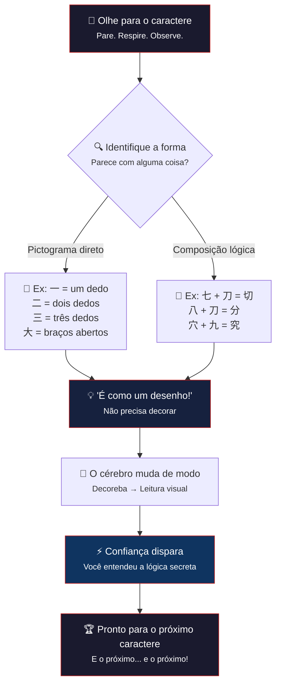

### 1. 爆款標題 (Hook Title)

> **「Hanzi Não São Rabiscos — São Desenhos que Estavam Te Esperando」**
> *Cada caractere chinês foi projetado para ser entendido à primeira vista — você só precisa saber o que procurar.*

### 2. 5W2H 核心矩陣 (The Strategy Table)

| 維度 | 關鍵解析 | 視覺映射 |
| :--- | :--- | :--- |
| 🎯 **What** | Os hanzi (caracteres chineses) são um sistema de escrita pictográfico e lógico — cada traço carrega significado visual e histórico, não é decoreba aleatória. | Um **quebra-cabeça 3D** onde cada peça se encaixa perfeitamente para formar um caractere completo. |
| 💡 **Why** | 90% das pessoas desistem do chinês porque acham que "memorizar caracteres é impossível" — mas eles foram feitos para serem *compreendidos*, não decorados. | Uma **lâmpada que acende** acima da cabeça de um mini-personagem, com um caractere se formando dentro da lâmpada. |
| 👤 **Who** | Iniciantes absolutos que sentem medo ou frustração ao olhar para caracteres chineses pela primeira vez. | Um **mini-estudante** sentado em uma cadeira, com os olhos arregalados de surpresa ao ver um caractere se "abrir" como um presente. |
| 📍 **Where** | Na mente do aprendiz — é uma mudança de paradigma: de "decoreba" para "leitura visual". | Um **cérebro translúcido** com engrenagens internas que giram; uma das engrenagens tem formato de caractere chinês. |
| ⏳ **Timeline** | 1) Medo inicial → 2) Primeira surpresa (一二三) → 3) Conexão lógica (七+刀=切) → 4) Empoderamento ("Eu entendi!"). | Uma **rampa ascendente** em quatro degraus, cada um com um caractere diferente iluminado. |
| 🛠️ **How** | 3 chaves: (a) Olhar para a forma física do caractere, (b) Identificar componentes visuais (radicais), (c) Conectar ao significado original. | Uma **lupa** ampliando um caractere, revelando suas partes internas como blocos de Lego. |
| 💰 **Impacto** | O aluno descobre que já sabe ler e escrever dezenas de caracteres em minutos — a confiança dispara e o bloqueio mental se dissolve. | Um **termômetro de confiança** que sobe de "😰 Medo" para "🤯 Descobridor" em segundos. |

### 3. Mermaid 流程圖 (How 邏輯表達)

### 4. 視覺場景描述 (The Prompt for Imagination)

**Scene Setting**: Um cenário isométrico 3D em uma antiga sala de estudos chinesa ao entardecer. No centro, uma **mesa de madeira laqueada vermelha** coberta de pergaminhos abertos que mostram a evolução dos caracteres numéricos — de pictogramas primitivos a hanzi modernos.

**Paleta de Cores**:
- Fundo: Vermelho escuro (#4a0000) a carmim (#8b0000) com sombras profundas
- Destaque: Âmbar quente (#ff8c00) e dourado pálido (#eab308)
- Toque: Tinta preta azeviche (#111111) nos traços dos caracteres

**Core Objects**:
- Uma **mão gigante translúcida** feita de luz dourada pairando sobre a mesa, com o dedo indicador estendido na horizontal — formando o caractere **一** no ar com um rastro luminoso.
- Ao lado, **blocos de madeira 3D** flutuam como Lego: cada bloco tem um traço de caractere gravado. Alguns blocos estão se encaixando sozinhos para formar **七 + 刀 = 切**.
- Uma **lupa flutuante** com lente de cristal amplia um pergaminho, revelando camadas internas de um caractere — como um diagrama de anatomia.
- **Lanternas vermelhas** pendem do teto, suas chamas tremeluzindo e projetando sombras dançantes dos caracteres nas paredes.

**Character Interaction**:
- Dois **mini-personagens** (silhuetas douradas) estão sentados à mesa: um aponta surpreso para o caractere **四**, enquanto a mão do outro está levantada mostrando 4 dedos — conectando o gesto à escrita.
- Um terceiro mini-personagem está em pé sobre uma pilha de livros, segurando o caractere **十** formado por dois gravetos cruzados, como se tivesse acabado de descobrir algo.
- **Pequenas partículas vermelhas e douradas** flutuam no ar como faíscas de entendimento — cada vez que um personagem "entende" um caractere, uma partícula acende.

**Mood**: Acolhedor, mágico, revelador. O espectador deve sentir que está testemunhando o momento exato em que alguém "se liga" na lógica secreta dos hanzi — uma descoberta emocionante e íntima.

### 5. 金句摘要 (Final Takeaway)

> 💡 **「Cada caractere chinês é uma mensagem em garrafa jogada no mar do tempo — eles foram feitos para serem abertos, compreendidos e lembrados. Não decore: apenas veja."**
