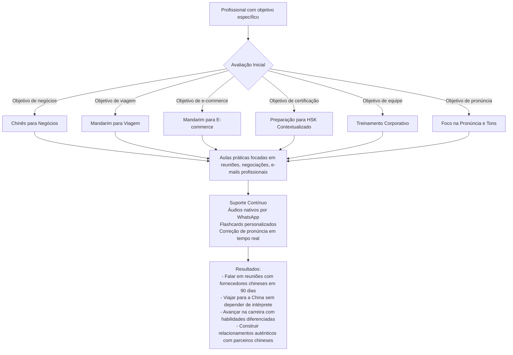

### 1. 爆款标题 (Hook Title)
> Fale mandarim em 90 dias: o segredo da "Mãe Chinesa" para profissionais ocupados
> *Lead: Descubra como executivos de São Paulo estão liderando reuniões com fornecedores chineses sem intérprete em apenas 3 meses com nosso método de imersão prática.*

### 2. 5W2H 核心矩阵 (The Strategy Table)
| 维度 | 关键解析 | 视觉映射 (用于圖解物件) |
| :--- | :--- | :--- |
| 🎯 **What** | Programa de imersão em mandarim focado em profissionais e estudantes de carreira, com metodologia baseada na abordagem da "Mãe Chinesa" | Um relógio de areia gigante onde, em vez de areia, frases em mandarim fluem do topo (chinês) para a base (português), sendo transformadas por micropessoenas em pequenos laboratórios de linguagem |
| 💡 **Why** | Métodos tradicionais falam com profissionais porque focam em teoria inútil e decorativo, não no que é realmente necessário para negócios e carreira com a China | Micropessoena frustrada tentando beber de uma fonte marcada "GRAMÁTICA ABSTRATA" enquanto outra com um sorriso bebe diretamente de uma fonte marcada "FRASES PRÁTICAS PARA REUNIÕES" |
| 👤 **Who** | Profissionais ocupados, empreendedores, estudantes de carreira e empresários que precisam de mandarim para negócios com a China, viagens ou avanço profissional | Micropessoenas com diferentes uniformes: terno de negócios (para reuniões), mochila de viagem (para aeroporto), jaleco de fábrica (para inspeções) e livro didático aberto com um X vermelho sendo substituído por um smartphone com áudio |
| 📍 **Where** | Aulas online com foco em aplicação prática, atendendo profissionais de todo o Brasil com êxito especial no ecossistema corporativo de São Paulo | Miniatura do centro financeiro de São Paulo (avenida Faria Lima) conectada por linhas de ondas sonoras a ícones de Xangai (Oriental Pearl Tower), Guangzhou (Cantón Tower) e Shenzhen (Ping An Finance Centre) |
| ⏳ **When** | Resultados visíveis em 30 dias, fluência funcional em 90 dias com prática diária de 20-30 minutos | Um calendário gigante onde os primeiros 30 dias mostram micropessoenas struggling com tons, os próximos 30 mostrando confiança crescente e os últimos 30 mostrando liderando reuniões em chinês |
| 🛠️ **How** | Método em 3 fases: 1) Avaliação personalizada de objetivos e nível, 2) Aprendizado prático focado no uso imediato (sem teoria inútil), 3) Suporte contínuo com áudios nativos, flashcards e correção de pronúncia em tempo real | Três estações de trem interligadas: "Avaliação" (micropessoena em uma cabine com perguntas aparecendo em tela), "Prática" (micropessoena em um cenário de aeroporto/fábrica/reunião falando chinês), "Suporte" (micropessoena recebendo notificações de áudio e flashcards em um smartwatch) |
| 💰 **How Much** | Economia de tempo (resultados em 90 dias vs anos com métodos tradicionais), aplicação imediata no trabalho, aumento de confiança para interagir com nativos sem medo de errar | Balança gigante: numa prato um relógio marcado "ANOS" com uma pilha de livros fechados e uma cara de stress, no outro prato um relógio marcado "90 DIAS" com um mikrofonede fala, um cartão de visita trocado com ambas as mãos e um troféu, sendo pesada por um micropessoeno de terno sorrindo |

### 3. Mermaid 流程圖 (How 逻辑表达)

### 4. 视觉场景描述 (The Prompt for Imagination)
**场景设定**：Um laboratório de linguagem futurista em 3D onde profissionais de diferentes áreas aprendem mandarim através de imersão prática, simulando situações reais do dia a dia profissional com suporte tecnológico contínuo
- **主色调**：莫兰디verde-água suave (#A8D5BA), azul compromisso profundo (#4A90E2) e laranja terracota queimado (#D4A373) com branco gelo
- **核心物件**：Um relógio biônico gigante no centro do laboratório, cujo mostrador mostra não horas, mas etapas de proficiência em mandarim (de "tons básicos" a "negociação fluente"), com micropessoenas ajustando os ponteiros enquanto praticam
- **人物互ações**： 
  - Zona de avaliação: Micropessoena respondendo perguntas em tela sobre seus objetivos específicos (ex: "Preciso liderar reuniões com fornecedores de Guangdong")
  - Zona de simulação de aeroporto: Micropessoena praticando check-in e alfândega com um instrutor virtual chinês em tela holográfica
  - Zona de reunião de negócios: Duas micropessoenas (uma brasileira de terno, outra chinesa de camisa social) trocando cartões de visita com ambas as mãos enquanto negociam preços em chinês
  - Zona de fábrica: Micropessoena de jaleco inspecionando produtos enquanto dá instruções de qualidade em chinês para um fornecedor virtual
  - Zona de suporte: Micropessoena recebendo notificação de áudio no smartwatch, ouvindo uma frase nativa e repetindo imediatamente com feedback visual de precisão tons
  - Zona de flashcards: Micropessoena deslizando cartões virtuais com cenários específicos (ex: "Como pedir amostra grátis no Alibaba?")

### 5. 金句摘要 (Final Takeaway)
> 💡 **「Você não aprende mandarim decorando caracteres - você aprende vivendo as situações onde vai usá-lo, exatamente como uma criança aprende sua língua materna」**